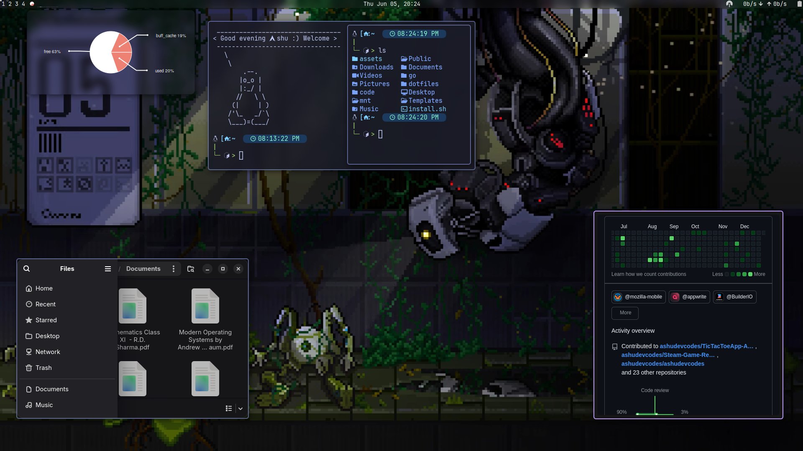

# Arch Dotfiles

Repository For my personal dotfiles from Arch, its contain the configurations of Neovim, awesomewm and various system utilities.

<kbd>
   
   <kbd>awesomewm</kbd>
</kbd>

<kbd>
   
   <kbd>awesomewm</kbd>
</kbd>

## Components

### Neovim

My Neovim setup includes the following plugins:

- [nvim-cmp](https://github.com/hrsh7th/nvim-cmp): Completion plugin
- [conform.nvim](https://github.com/stevearc/conform.nvim): Code formatting
- [Comment.nvim](https://github.com/numToStr/Comment.nvim): Code commenting
- [flash.nvim](https://github.com/folke/flash.nvim): Fast navigation
- [nvim-lspconfig](https://github.com/neovim/nvim-lspconfig): Language Server Protocol configuration
- [lualine.nvim](https://github.com/nvim-lualine/lualine.nvim): Status line
- [mason-lspconfig.nvim](https://github.com/williamboman/mason-lspconfig.nvim): LSP server management
- [tagbar](https://github.com/preservim/tagbar): Tag browsing
- [telescope.nvim](https://github.com/nvim-telescope/telescope.nvim): Fuzzy finder
- [tokyonight.nvim](https://github.com/folke/tokyonight.nvim): Color scheme
- [nvim-treesitter](https://github.com/nvim-treesitter/nvim-treesitter): Syntax highlighting
- [which-key.nvim](https://github.com/folke/which-key.nvim): Keybinding helper
- [nvim-ufo](https://github.com/kevinhwang91/nvim-ufo): Collapse block

### System Utilities

- [Fastfetch](https://github.com/fastfetch-cli/fastfetch): System information tool
- [Starship](https://starship.rs/): Cross-shell prompt
- [Wezterm](https://wezterm.org/): Terminal emulator
- [AwesomeWM](https://awesomewm.org/): Tiling window manager

## Installation

- TODO Make installation script that automte download all plugins

## Contributing

Feel free to open issues or submit pull requests if you have suggestions for improvements.

## License

